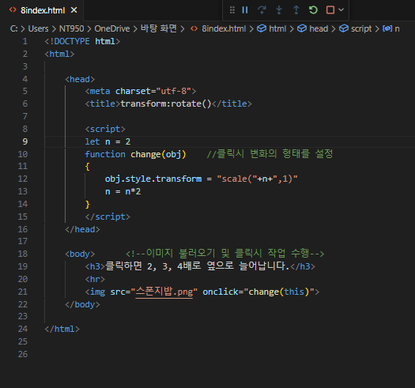
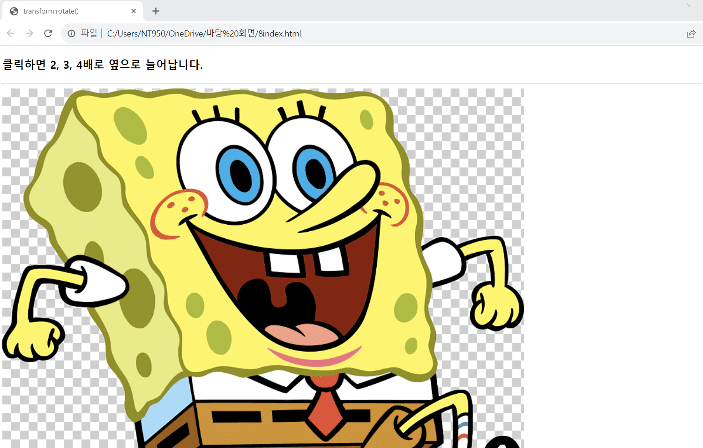
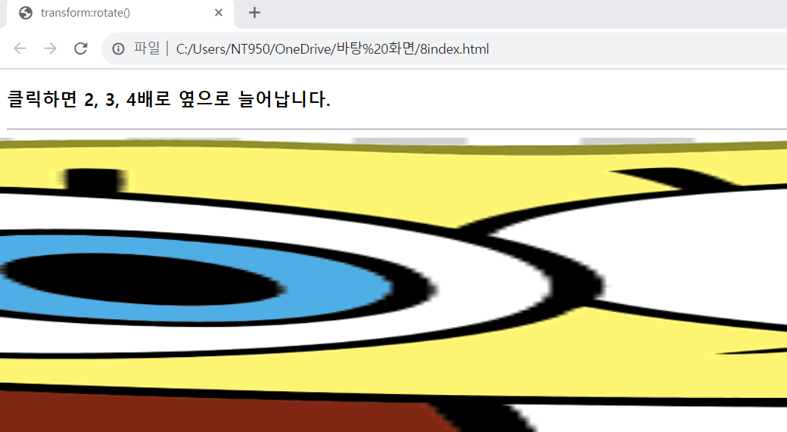

# 이미지를 클릭할 때마다 옆으로 2,3,4배로 확대하여 출력하는 웹 페이지를 작성하라.

 #### 추가 및 안내 사항

>   1.  obj.style.transform="scale(2,1)";은 obj를 옆으로 2배 확대시킨 모양으로 출력한다.
>   >
>   2.  "클릭할 때마다" 확장  

 </img> 
 </img> 
 </img> 
