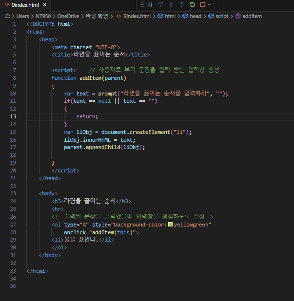
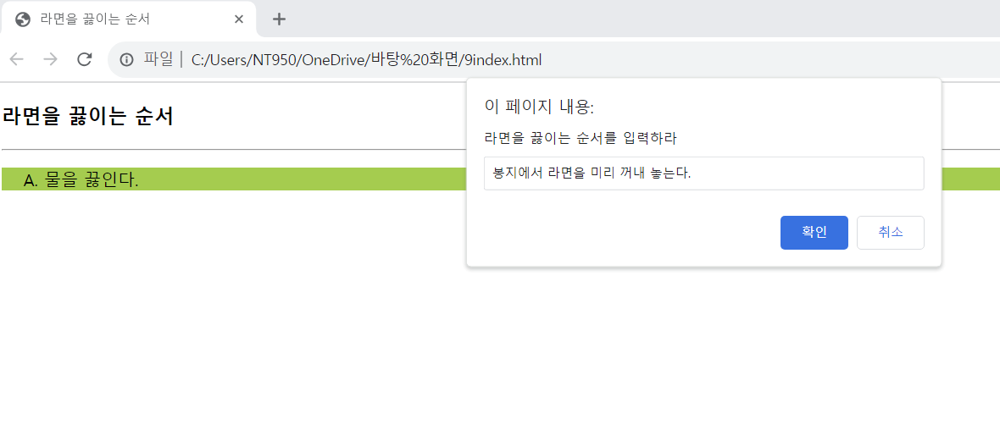
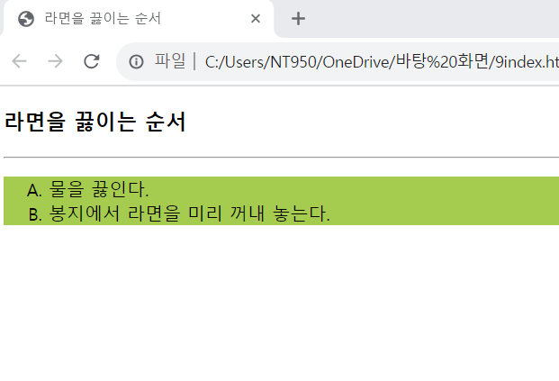

# HTML 페이지와 브라우저의 출력 결과가 있을 때 yellowgreen으로 칠해진 영역은 &lt;ol&gt;이 출력된 영역이다. 이 영역에 마우스로 클릭하면 다음과 같이 prompt()함수를 출력하고, 사용자로부터 입력받은 문자열로 라면을 끓이는 순서를 하나씩 삽입하는 자바스크립트 코드를 삽입하라.

 #### 추가 및 안내 사항

>   1.   아무곳이나 클릭했을 때 사용자로부터 입력을 받는 입력창 생성
>   >
>   2.  입력창을 생성했을 때 입력받은 문장을 동일한 영역에 추가하도록 설정 

 </img> 
 </img> 
 </img> 
