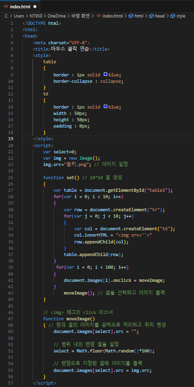
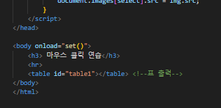
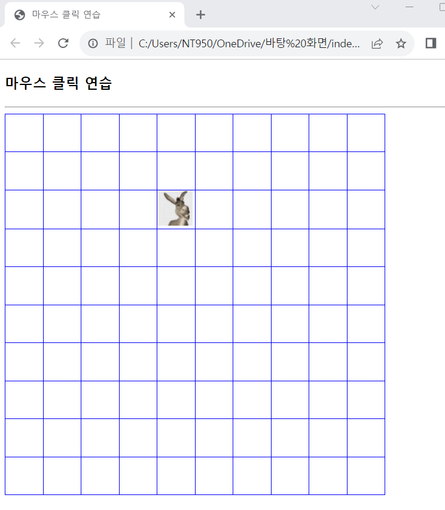

# 마우스 클릭 연습

### 마우스 클릭을 연습하는 웹 페이지를 작성해보자.

 #### 추가 및 안내 사항

>    1. 10*10의 셀을 가진 표 출력
>    >
>    2. 기본 값으로 랜덤하게 선택된 셀에 지정된 이미지를 출력
>    >
>    3. 사용자가 셀에 있는 이미지를 클릭하면 이미지가 랜덤한 다른 셀에 출력
>    >
>    4. (기존에 있던 이미지는 사라진다.)

 </img> 
 </img> 
 </img> 
