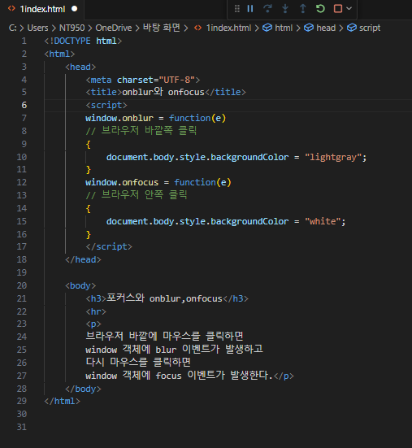
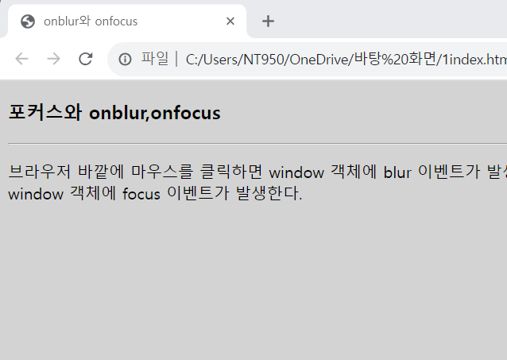
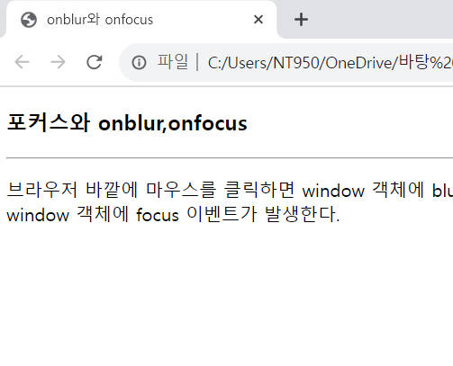

# 브라우저 내의 아무곳이나 클릭하면 기본 배경색인 흰색으로 설정되고, 브라우저 바깥은 아무 곳에 마우스를 클릭하면 브라우저의 배경색이 lightgray로 바뀌도록 웹 페이지를 작성하라.

 #### 추가 및 안내 사항

>   1. 포커스를 가지고있는 상태와 포커스를 잃게 되는 경우 배경색의 차이가 있도록 설정
>   >
>   2. 브라우저 바깥에 마우스를 클릭하면 브라우저의 window 객체는 포커스를 잃게 되어 blur 이벤트가 발생한다. -> window 객체에 onblur 리스너를 작성 

 </img> 
 </img> 
 </img> 
