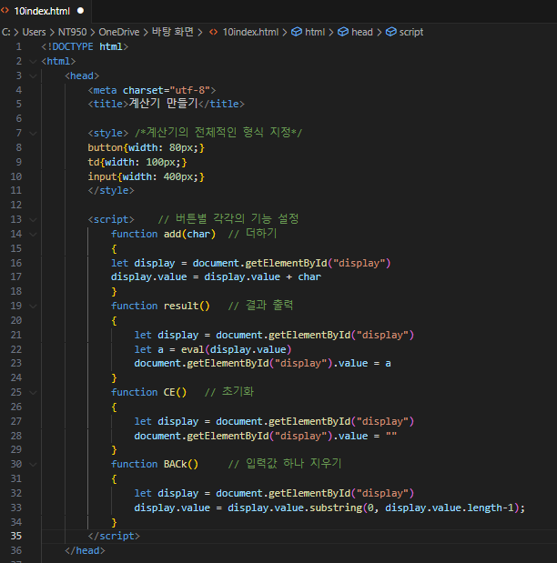
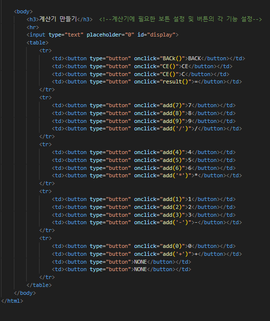
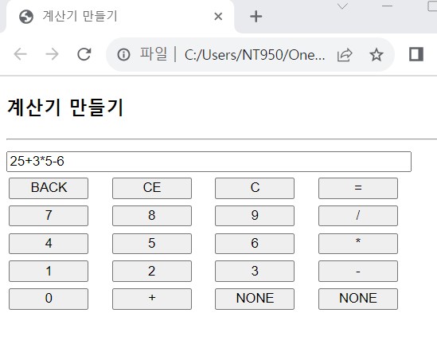
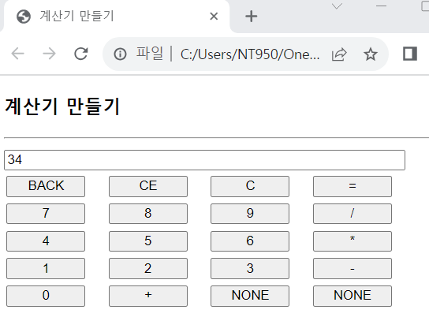

# 계산기 웹 페이지를 작성하라. 입력 창에는 초기에 0이 출력된다. 숫자와 연산자 버튼을 눌러 계산식을 만들고 = 버튼을 클릭하면 계산 결과를 출력한다. BACK 버튼을 누르면 입력창의 마지막 문자를 지운다. CE나 C버튼은 같은 기능으로, 입력창의 내용을 모두 지우고 처음처럼 0이 출력되게 한다. NONE버튼은 아무 기능이 없다.

#### 추가 및 안내 사항

>    1. 만들어진 수식은 eval() 함수를 이용하여 계산
>    >
>    2. = 버튼이 클릭되었을 때 사용자가 만든 연산식이 수행되고 값이 출력되도록 설정

 </img> 
 </img> 
 </img> 
 </img> 
