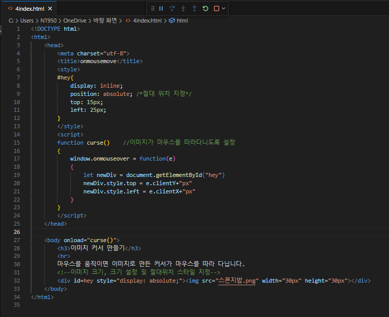
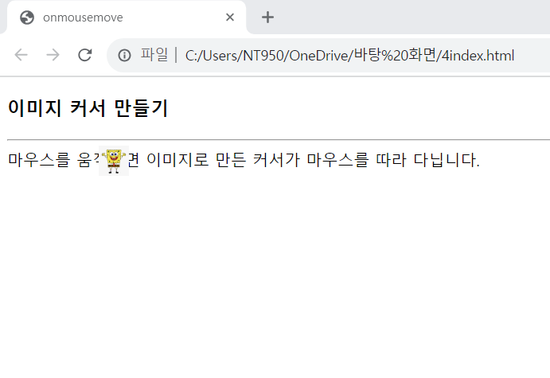

# onmousemove를 이용하여 웹 페이지에 마우스가 움직일 때 이미지를 마우스 커서처럼 사용하도록 웹 페이지를 작성하라. 이미지는 가로 30픽셀, 세로 30픽셀 크기로 하라.

 #### 추가 및 안내 사항

>   1. 이미지를 가진 &lt;div&gt; 블록을 만들고 절대 위치 display:absolute로 지정
>   >
>   2. document.onmousemove(혹은 window.onmousemove)에서 마우스의 위치를 따라 계속 &lt;div&gt; 위치를 변경 

 </img> 
 </img> 
