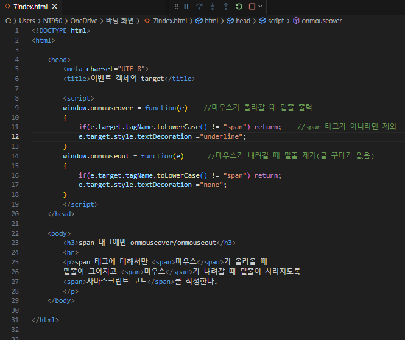
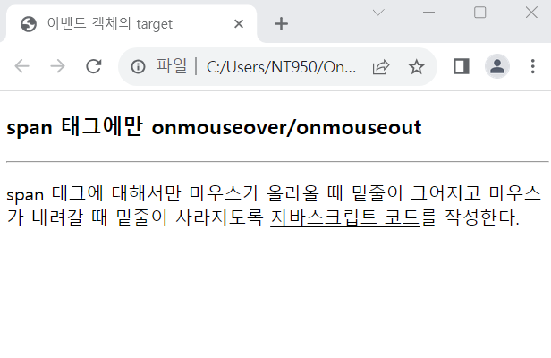

# 웹 페이지에 있는 모든 &lt;span&gt; 태그에 대해, 마우스가 올라오면 해당 태그의 텍스트에 밑줄을 긋고, 내려가면 밑줄을 지우는 자바스크립트 코드를 완성하라.

 #### 추가 및 안내 사항

>   1. 이벤트가 발생하면, 이벤트 객체를 검사하여 e.target.tagName=="SPAN"인 경우만 처리
>   >
>   2. tagName 프로퍼티는 항상 대문자의 문자열을 가진다. 

 </img> 
 </img> 
