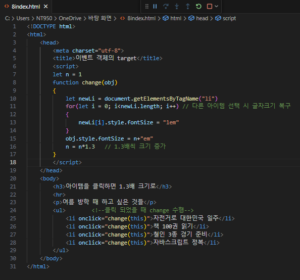
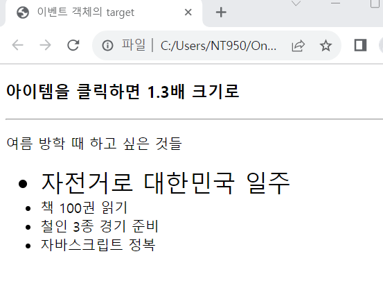

# 다음 웹 페이지에서 &lt;li&gt; 아이템을 클릭하면 텍스트 크기를 1.3배(1.3em)로 출력하도록 자바스크립트 코드를 작성하라. 다른 아이템이 클릭되면 이전 아이템을 원래 크기로(1em) 출력한다.

#### 추가 및 안내 사항

>  document.getElementsByTagName("li")를 이용

 </img> 
 </img> 
