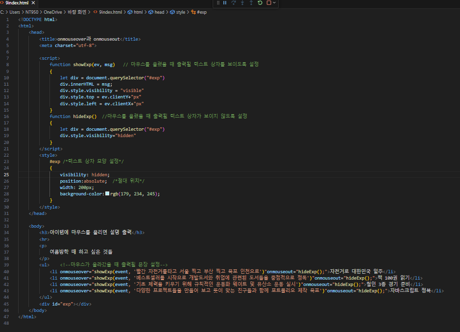
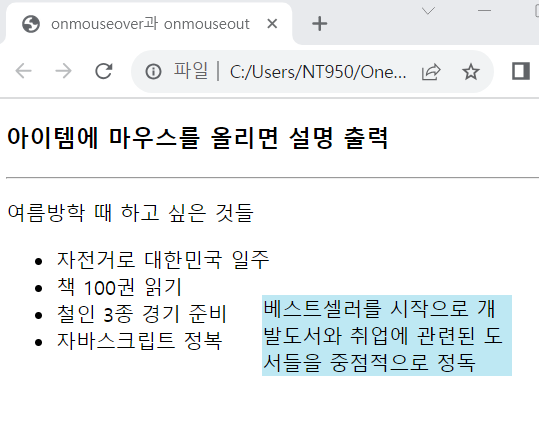

# 리스트를 만들고 아이템 영역 안에 마우스가 들어오면 다음과 같이 자세한 설명을 출력하는 웹 페이지를 작성하라.

#### 추가 및 안내 사항

>    1. &lt;li&gt;태그에 onmouseover, onmouseout 리스너를 작성
>    >
>    2. onmouseover에서는 미리 position:absolute로 지정한 &lt;div&gt; 태그를 마우스가 올라온 위치로 배치하고 &lt;div&gt; 태그의 innerHTML에 적당한 텍스트를 출력
>    >
>    3. visibility 스타일에 "visible"을 부여
>    >
>    4. onmouseout에서는 &lt;div&gt; 태그의 visibility 스타일에 "hidden"을 주어 보이지 않게 설정

 </img> 
 </img> 
