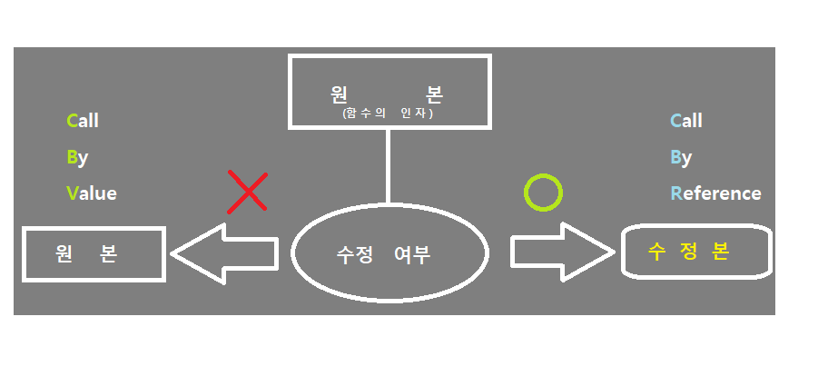

<!------------------제 목------------------------->

# 7주차 웹 프로그래밍 과제

<!----------------------- 앵커로 연결된 목차 지정--------------------------->

#### - 목 차 -

<li><a href="#first">1. 동적 웹 페이지와 정적 웹 페이지의 차이</a></li>
<li><a href="#second">2. PHP에 설치된 모듈(20개)의 종류 및 역할</a></li>
<li><a href="#third">3. PHP에서 사용되는 스크립트 엔진</a></li>
<li><a href="#fourth">4. 웹 브라우저에서 'http://www.abc.com/abc.php' 페이지를 접속했을 때 서버가 하는 일</a></li>
<li><a href="#fifth">5. call by value와 call by reference의 차이점</a></li>
  

<!------------------------------첫 번째 문제--------------------------------------->

### <strong id = "first"><b>1. 동적 웹 페이지와 정적 웹 페이지의 차이를 설명하시오</b></strong>
 

-웹 페이지는 크게 <b>'정적 웹 페이지'(Static Web PAge)</b>와 <b>'동적 웹 페이지'(Dynamic Web Page)</b>로 나뉜다.

<dt><strong><li>'정적 웹 페이지'(Static Web Page)란?</strong></dt>
 
<dd>
  - 만들어놓은 것을 그대로 제공하는 페이지라고 할 수 있으며 image, html, css, javascript 파일과 같이 컴퓨터에 저장되어 있는 파일들을 의미한다. 
  - 웹 서버에 이미 저장된 파일(HTML파일, 이미지, JavaScript 파일 등)을 클라이언트에게 전송하는 웹 페이지 
  - 사용자는 서버에 저장된 데이터가 변경되지 않는 한 고정된 웹 페이지를 계속 보게 된다.(사용자와 상호작용 불가) 
  - 따라서 모든 사용자는 같은 결과의 웹 페이지를 서버에 요청하고 응답 받게 된다. 
  - 웹 서버에서 제공한다. 
</dd>

 <dt><strong><li>정적 웹 페이지의 장/단점</strong></dt>

< 장 점 > 
- 다른 처리 없이 요청에 대한 파일만 전송하기 때문에 속도가 빠르다. 
- 단순한 문서로 웹 서버를 구축하므로 호스팅 서버에 연결하는 비용이 적다. 

< 단 점 > 
- 저장된 정보만 보여주기 때문에 서비스가 한정적이다. 
- 추가, 삭제, 수정 등의 작업이 모두 코드를 직접 건드려야 하기 때문에 관리가 힘들다. 

 <dt><strong><li>'동적 웹 페이지'(Dynamic Web Page)란?</strong></dt>
<dd>
  - 사용자로부터 들어온 요청에 맞게 동적으로 만들어진 콘텐츠를 의미한다. 
  - 데이터베이스, 서버 내 로직 등을 활용해 만들어진 콘텐츠를 반환한다.(요청과 조건에 따른 다른 결과를 보게 된다.) 
  - 웹 어플리케이션 서버에서 제공한다. 
</dd>

 <dt><strong><li>동적 웹 페이지의 장/단점</strong></dt>

< 장 점 > 
- 다양한 정보를 조합하여 웹 페이지를 제공하기 때문에 서비스가 다양하다. 
- 웹 사이트 구조에 따라 추가, 수정, 삭제 등의 기능을 사용자 측에서 사용이 가능하기 때문에 관리가 쉽다. 
- 관리가 쉽기 때문에 전체적인 사이트 운용 비용이 절감될 수 있다. 

< 단 점 > 
- 사용자에게 웹 페이지를 전달하기 전에 처리하는 작업이 필요하기 때문에 상대적으로 느리다. 
- 웹 서버외에 추가적으로 처리를 위한 어플리케이션 서버(WAS)가 필요하기 때문에 추가적인 비용이 들어간다. 

 - 추가적으로 정적 페이지는 'Web Server'에서 처리하고 동적 페이지는 'WAS(Web Application Server)'에서 처리하게 된다.  
 다음은 각각의 서버에 대한 간단한 개념이다. 

 <dt><strong><li>'Web Server'란?</strong></dt>

- HTTP 요청을 받아 Static contents(정적 컨텐츠)를 제공하는 서버, 프로그램 
- HTTP 프로토콜을 기반으로 하여 클라이언트의 요청을 서비스하는 기능을 담당 

 <dt><strong><li>Web Server의 기능</strong></dt>
- 정적인 컨텐츠 제공 : WAS를 거치지 않고, 바로 요청한 컨텐츠를 제공할 수 있다. 
- 동적인 컨텐츠 제공을 위한 요청 전달 : 요청을 WAS에 보내고, WAS가 처리한 결과를 클라이언트에게 전달한다. 

 <dt><strong><li>'WAS'(Web Application Server)란?</strong></dt>

- 다양한 서버 내 알고리즘, 비즈니스 로직, DB 조회 등 클라이언트 요청에 따라 동적인 컨텐츠를 제공하는 서버 
- HTTP 프로토콜을 기반으로 하여 클라이언트의 요청에 따라 구현된 비즈니스 로직을 통해 동적으로 만들어진 컨텐츠를 반환(Ex. Tomcat, JBoss, Jeus, ...) 
- 데이터베이스 접속 기능, 여러 개의 트랜잭션 관리 등 수행 
- 즉, 웹 어플리케이션 서버는 웹 서버에서 요청을 받고, 이를 웹 컨테이너로 보내 로직(알고리즘, DB 연결 등)을 수행하고 그 결과를 다시 웹 서버로 보내 최종적으로 클라이언트에게 보내주는 서버라고 할 수 있다. 

<!-------------------------------두 번째 문제----------------------------------->

### <strong id = "second"><b>2. PHP에 설치된 모듈(20개)은 어떤 것이 있는지 조사하시오.</b></strong>
 

- 일반적으로 PHP에 설치되어있는 모듈들 중 20개 정도에 대해 기술해보고 각각의 모듈들의 기능에 대해 알아보자

<ul>
<ol type="1">
  <li><b>mysqli</b>: MySQL 데이터베이스에 대한 확장된 인터페이스를 제공하는 모듈</li>
  <li><b>gd</b>: 그래픽 데이터 처리 및 이미지 조작을 위한 모듈.</li>
  <li><b>curl</b>: URL을 통한 데이터 전송을 위한 모듈.</li>
  <li><b>json</b>: JSON 데이터 형식을 다루기 위한 모듈.</li>
  <li><b>xml</b>: XML 데이터 처리를 위한 모듈.</li>
  <li><b>openssl</b>: 암호화 및 보안 기능을 위한 모듈.</li>
  <li><b>mbstring</b>: 다국어 문자열 처리를 위한 모듈.</li>
  <li><b>pdo</b>: 데이터베이스에 접속하기 위한 표준 인터페이스.</li>
  <li><b>zip</b>: ZIP 파일을 조작하기 위한 모듈.</li>
  <li><b>exif</b>: 이미지의 Exif 데이터를 읽기 위한 모듈.</li>
  <li><b>ftp</b>: FTP 프로토콜을 통한 파일 전송을 지원하는 모듈.</li>
  <li><b>xmlrpc</b>: XML-RPC 통신을 지원하는 모듈.</li>
  <li><b>bcmath</b>: 임의 정밀도 연산을 수행하기 위한 모듈.</li>
  <li><b>pdo_mysql</b>: MySQL 데이터베이스와 상호 작용하기 위한 PDO 드라이버.</li>
  <li><b>pdo_sqlite</b>: SQLite 데이터베이스와 상호 작용하기 위한 PDO 드라이버.</li>
  <li><b>shmop</b>: 공유 메모리 세그먼트를 조작하기 위한 모듈.</li>
  <li><b>soap</b>: 웹 서비스와 상호 작용하기 위한 모듈.</li>
  <li><b>sockets</b>: 소켓 프로그래밍을 지원하는 모듈.</li>
  <li><b>opcache</b>: 코드 실행 속도를 향상시키기 위한 opcode 캐시 모듈.</li>
  <li><b>fileinfo</b>: 파일 형식을 식별하기 위한 모듈.</li>
</ul>
 

<!-------------------------------세 번째 문제----------------------------------->

### <strong id = "third"><b>3. PHP에서 사용되는 스크립트 엔진에 대해 기술하시오.</b></strong>
 

 - PHP 스크립트는 일반적으로 HTML 코드 안에 포함되어 있고, 서버에서 실행되면 동적인 콘텐츠를 생성하여 클라이언트에게 제공한다. PHP스크립트를 실행하기 위해 필요한 엔진은 PHP엔진인데 그 예로 'Zend 엔진'을 말할 수 있다. 

<li> Zend 엔진 : PHP스크립트를 파싱하고 실행할 때 사용되며 성능을 향상시키기 위해 여러 최적화 기술을 적용한다. 

다른 PHP엔진의 예시로는 HHVM(HipHop Virtual Machine)등이 있다. 

<li> HHVM 엔진 : Facebook에서 개발한 엔진으로, PHP 코드를 빠르게 실행할 수 있다. 

<!-------------------------------네 번째 문제----------------------------------->

### <strong id = "fourth"><b>4. 웹 브라우저에서 http://www.abc.com/abc.php 페이지를 접속했을 때, 서버는 어떠한 일을 수행하는가?</b></strong>

- 해당 페이지에 접속했을 때 서버가 수행하는 일은 순서도로 나타낼 수 있다.

 
<ul>
<ol type="1">
  <li><b>DNS 해석</b>: 'www.abc.com'을 IP주소로 변환하기 위해 Domain Name System에 요청을 보낸다.</li>
  <li><b>서버 연결</b>: 얻은 IP주소를 사용하여 웹 서버에 TCP/IP연결을 시도한다.(기본-80번 포트)</li>
  <li><b>HTTP 요청</b>: 브라우저는 HTTP 프로토콜을 사용하여 웹 서버에게 패키지를 요청하는 HTTP 요청 메시지를 전송한다.</li>
  <li><b>PHP 처리</b>: 웹 서버는 HTTP 요청 메시지를 처리하고 해당 PHP파일을 실행하기 위해 PHP엔진에 전달한다.</li>
  <li><b>PHP 결과 생성</b>: PHP파일이 실행되면 서버는 PHP코드를 해석하고 결과를 생성한다.</li> 
  <li><b>HTTP 응답</b>: PHP 코드 실행이 완료되면 서버는 동적으로 생성된 HTML등의 내용을 포함한 HTTP 응답 메시지를 생상한 후 브라우저에 전송한다.</li>
  <li><b>브라우저 렌더링</b>: 브라우저는 전송된 HTTP응답 메시지를 해석하고 웹 페이지를 렌더링해서 사용자에게 보여준다.</li>
</ul>
 

<!-------------------------------다섯 번째 문제----------------------------------->

### <strong id = "fifth"><b>5. call by value와 call by reference의 차이점에 대해 기술하시오.</b></strong>
 

- call by value : 인자로 받은 값을 복사하여 처리(함수 내에서 값을 변경해도 원본 값은 변경되지 않는다. - 값의 불변성 유지에 용이)  
- call by reference : 인자로 받은 값의 주소를 참조하여 직접 값에 개입(함수 내에서 인수로 전달된 변수의 값을 변경하면 호출한 쪽에서도 해당 변수의 값이 변경된다.) 

<strong>(참고 이미지)</strong>
 </img> 

<strong>(call by value와 call by reference의 차이점)</strong> 
 
 

- call by value와 call by reference의 차이점은 각각의 장단점에서 찾아볼 수 있다. 
 

 
<dt><strong><li>call by value의 장/단점</strong></dt>
<dd>
  > 장점 : 복사하여 처리하기 때문에 원래 값이 보존되므로 안전하다. 
  > 단점 : 복사를 하여 처리하기 때문에 메모리의 사용량이 늘어난다. 
</dd>
 
<dt><strong><li>call by reference의 장/단점</strong></dt>
<dd>
  > 장점 : 복사를 하지 않고 직접 참조를 하기 때문에 작업 속도가 빠르다. 
  > 단점 : 직접 참조를 하기 때문에 원래의 값이 직접적으로 영향을 받는다. 
</dd>

