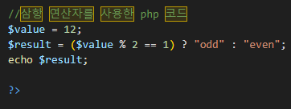

<!------------------제 목------------------------->

# 7주차 웹 프로그래밍 과제

<!----------------------- 앵커로 연결된 목차 지정--------------------------->
### 결과물 출력 링크(무료 호스팅 사이트'Hostinger'이용) : https://programingbymj.000webhostapp.com/

#### - 목 차 -

<li><a href="#first">1. $a라는 변수의 값이 홀수이면 그 숫자 다음 숫자인 짝수를 출력하고, $a의 값이 짝수이면 그 수를 출력하는 함수를 작성하고 테스트하시오.</a></li>
<li><a href="#second">2. while문을 이용하여 factorial 값을 구하는 함수를 작성하고 테스트하시오.</a></li>
<li><a href="#third">3.주어진 프로그램과 동일한 기능을 하는 프로그램을 삼항연산자( ? : )를 이용하여 작성고 테스트하시오.</a></li>
  

<!------------------------------첫 번째 문제--------------------------------------->

### <strong id = "first"><b>1. $a라는 변수의 값이 홀수이면 그 숫자 다음 숫자인 짝수를 출력하고, $a의 값이 짝수이면 그 수를 출력하는 함수를 작성하고 테스트하시오.</b></strong>
 

(1번 문제 소스코드 이미지)
 </img> 

<!-------------------------------두 번째 문제----------------------------------->

### <strong id = "second"><b>2. while문을 이용하여 factorial 값을 구하는 함수를 작성하고 테스트하시오.</b></strong>
 

(2번 문제 소스코드 이미지)
 </img> 

<!-------------------------------세 번째 문제----------------------------------->

### <strong id = "third"><b>3.주어진 프로그램과 동일한 기능을 하는 프로그램을 삼항연산자( ? : )를 이용하여 작성고 테스트하시오.</b></strong>
 

(3번 문제 소스코드 이미지)
  </img> 

### <strong id = "third"><b>PHP파일 종 웹 호스팅 결과 페이지 출력</b></strong>
 

    </img> 

