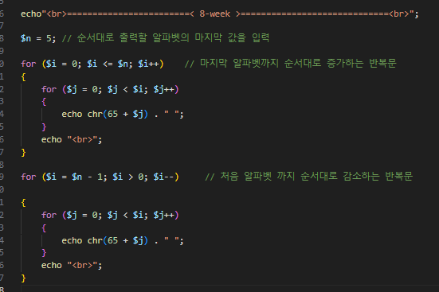
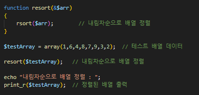
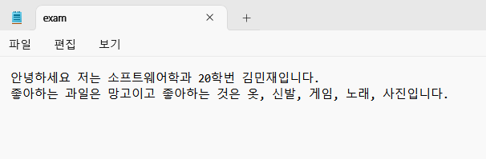
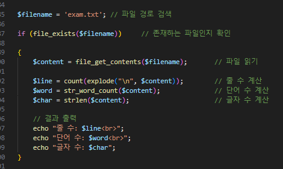
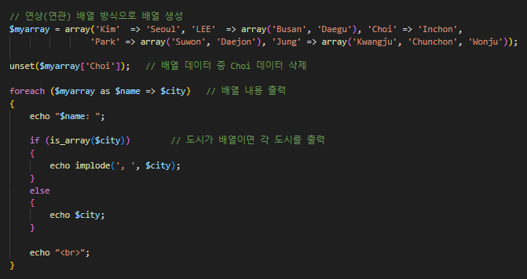
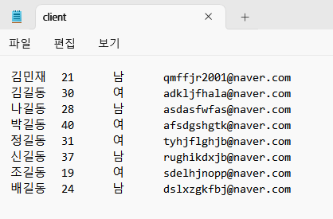
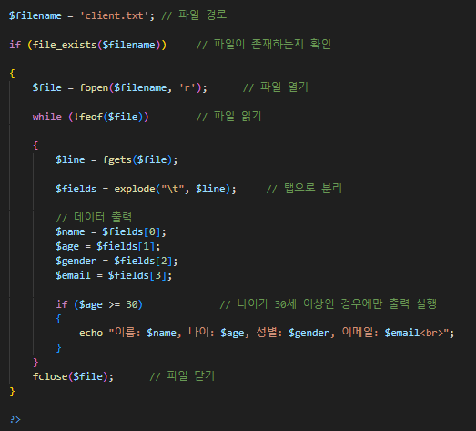
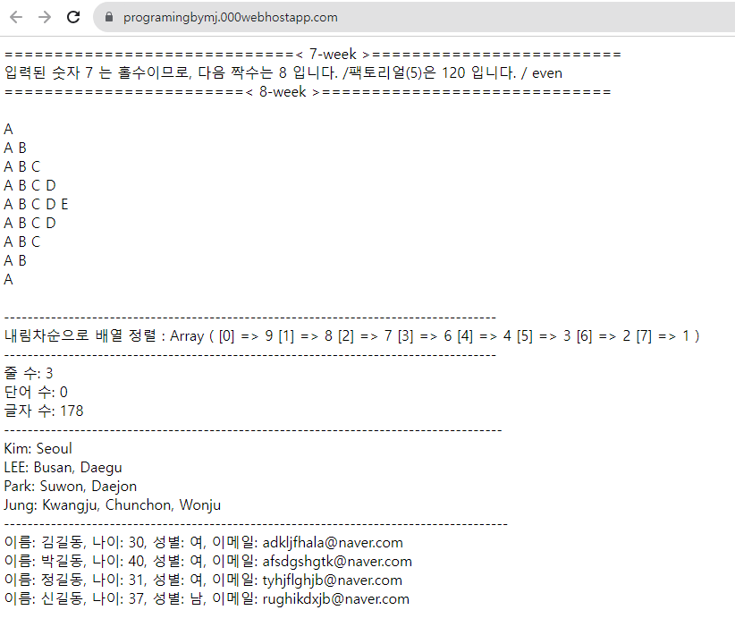

<!------------------제 목------------------------->

# 8주차 웹 프로그래밍 과제

<!----------------------- 앵커로 연결된 목차 지정--------------------------->
### 결과물 출력 링크(무료 호스팅 사이트'Hostinger'이용) : https://programingbymj.000webhostapp.com/
(가끔 접속이 되지 않는 문제가 있는데 몇 번 시도하면 페이지가 출력됩니다!)

#### - 목 차 -

<li><a href="#first">1. for문을 이용하여 조건에 맞는 출력을 하는 프로그램을 작성하시오.</a></li>
<li><a href="#second">2. 배열을 내림차순으로 정렬하고자 할  sort() 함수를 이용하여 revsort() 함수를 설계하고 테스트하시오.</a></li>
<li><a href="#third">3.'exam.txt' 라는 파일을 열어 그 파일의 줄 수, 단어 수, 글자 수를 계산하는 프로그램을 작성하시오.</a></li>
<li><a href="#fourth">4. 각각의 사람들이 현재까지 생활하였던 도시의 이름을 나타낸 데이터가 있을 때 해당 값들을 연상 배열로 선언한 후 Choi 항목을 삭제한 뒤 
                          연상 배열의 내용을 출력하는 PHP프로그램을 작성하시오.(단, vardump()함수 제외)</a></li>
<li><a href="#fifth">5. 고객 정보가 들어있는 파일인 'client.txt'가 있다. 이 파일에 저장된 자료의 구조는 ASCII 형식으로 저장이 되어있다고 할 때 이 파일을 읽어
                          나이가 30세 이상인 고객을 출력하는 프로그램을 작성하시오.</a></li>
<li><a href="#last">6. 최종 웹 호스팅 결과 페이지 출력</a></li>

  

<!------------------------------첫 번째 문제--------------------------------------->

### <strong id = "first"><b>1. for문을 이용하여 조건에 맞는 출력을 하는 프로그램을 작성하시오.</b></strong>
 

(1번 문제 소스코드 이미지)
 </img> 

<!-------------------------------두 번째 문제----------------------------------->

### <strong id = "second"><b>2. 배열을 내림차순으로 정렬하고자 할  sort() 함수를 이용하여 revsort() 함수를 설계하고 테스트하시오.</b></strong>
 

(2번 문제 소스코드 이미지)
 </img> 

<!-------------------------------세 번째 문제----------------------------------->

### <strong id = "third"><b>3.'exam.txt' 라는 파일을 열어 그 파일의 줄 수, 단어 수, 글자 수를 계산하는 프로그램을 작성하시오.</b></strong>
 

(3번 문제 'exam.txt'파일 내용)
 </img> 
(3번 문제 소스코드 이미지)
  </img> 

<!-------------------------------네 번째 문제----------------------------------->

### <strong id = "fourth"><b>4. 각각의 사람들이 현재까지 생활하였던 도시의 이름을 나타낸 데이터가 있을 때 해당 값들을 연상 배열로 선언한 후 Choi 항목을 삭제한 뒤 연상 배열의 내용을 출력하는 PHP프로그램을 작성하시오.(단, vardump()함수 제외)</b></strong>
 

(4번 문제 소스코드 이미지)
  </img> 

<!-------------------------------다섯 번째 문제----------------------------------->

### <strong id = "fifth"><b>5. 고객 정보가 들어있는 파일인 'client.txt'가 있다. 이 파일에 저장된 자료의 구조는 ASCII 형식으로 저장이 되어있다고 할 때 이 파일을 읽어 나이가 30세 이상인 고객을 출력하는 프로그램을 작성하시오.</b></strong>
 

(5번 문제 'client.txt'파일 내용)
 </img> 
(5번 문제 소스코드 이미지)
  </img> 

<!--------------------------------최종 결과-------------------------------------->

### <strong id = "last"><b>6. 최종 웹 호스팅 결과 페이지 출력</b></strong>
 

(웹 호스팅 결과 페이지 출력 이미지) 
    </img> 

