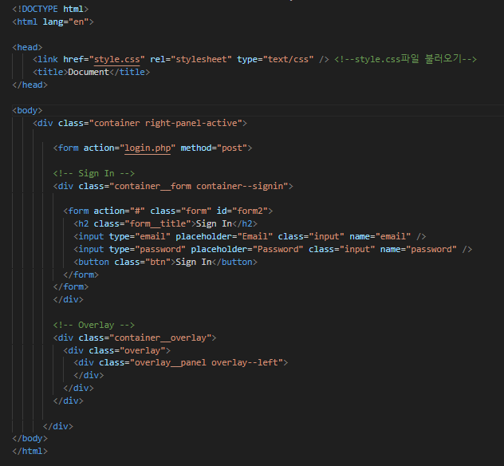
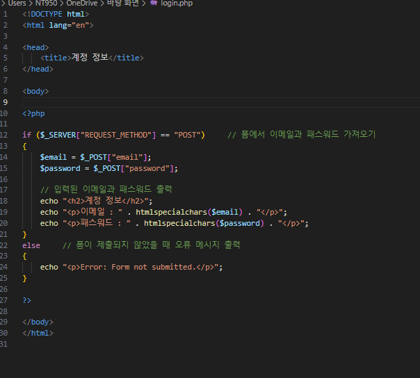
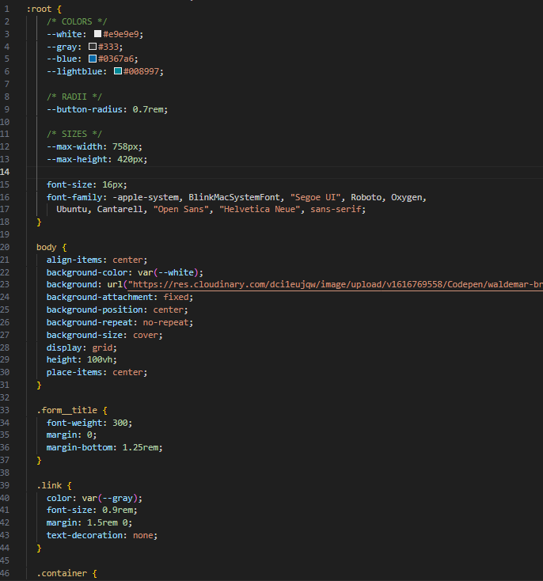
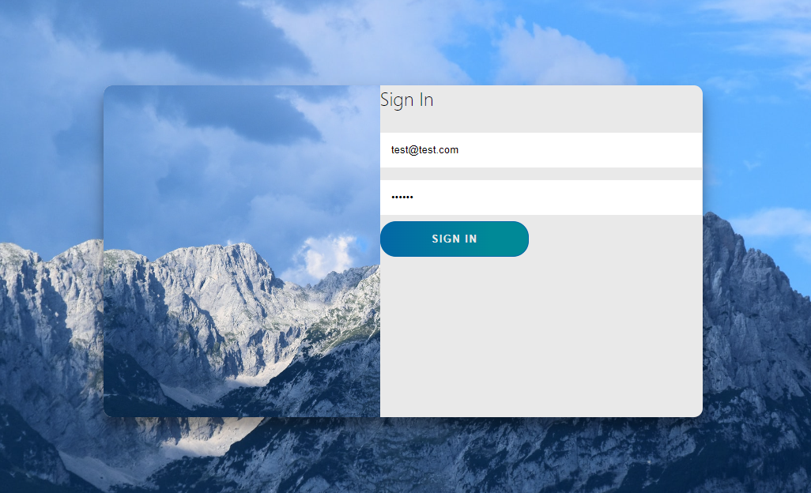
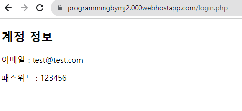

<!------------------제 목------------------------->

# 9주차 웹 프로그래밍 과제

<!----------------------- 앵커로 연결된 목차 지정--------------------------->
### 결과물 출력 링크(무료 호스팅 사이트'Hostinger'이용) : https://programmingbymj2.000webhostapp.com/

#### - 목 차 -

<li><a href="#first">1. HTML코드</a></li>
<li><a href="#second">2. PHP코드</a></li>
<li><a href="#third">3. CSS코드(온라인 CSS 디자인 참고)</a></li>
<li><a href="#fourth">4. 페이지 형태</a></li>
<li><a href="#fifth">5. 최종 출력</a></li>

  

<!------------------------------HTML코드--------------------------------------->

### <strong id = "first"><b>1. HTML코드</b></strong>
 

(HTML 소스코드 이미지)
 </img> 

<!-------------------------------PHP코드----------------------------------->

### <strong id = "second"><b>2. PHP코드</b></strong>
 

(PHP 소스코드 이미지)
 </img> 

<!-------------------------------CSS코드----------------------------------->

### <strong id = "third"><b>3. CSS코드(온라인 CSS 디자인 참고)</b></strong>
 

(CSS 소스코드 이미지)
 </img> 

<!-------------------------------결과 사진(1)----------------------------------->

### <strong id = "fourth"><b>4. 페이지 형태(단, vardump()함수 제외)</b></strong>
 

(페이지 형태)
  </img> 

<!-------------------------------결과 사진(2)----------------------------------->

### <strong id = "fifth"><b>5. 최종 출력</b></strong>
 

(최종 출력)
 </img> 

