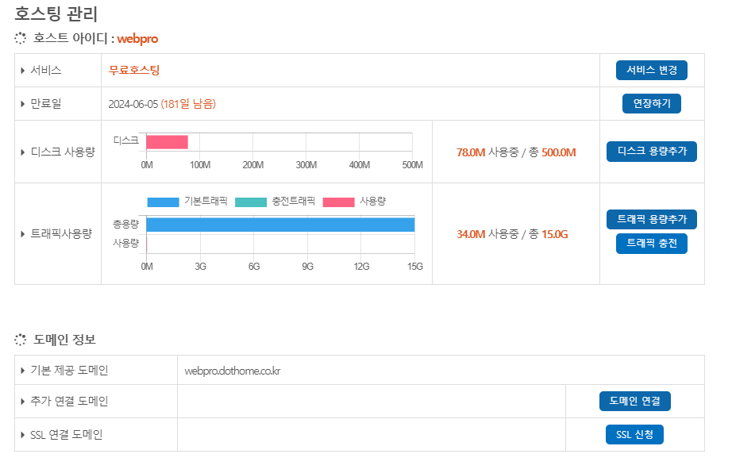
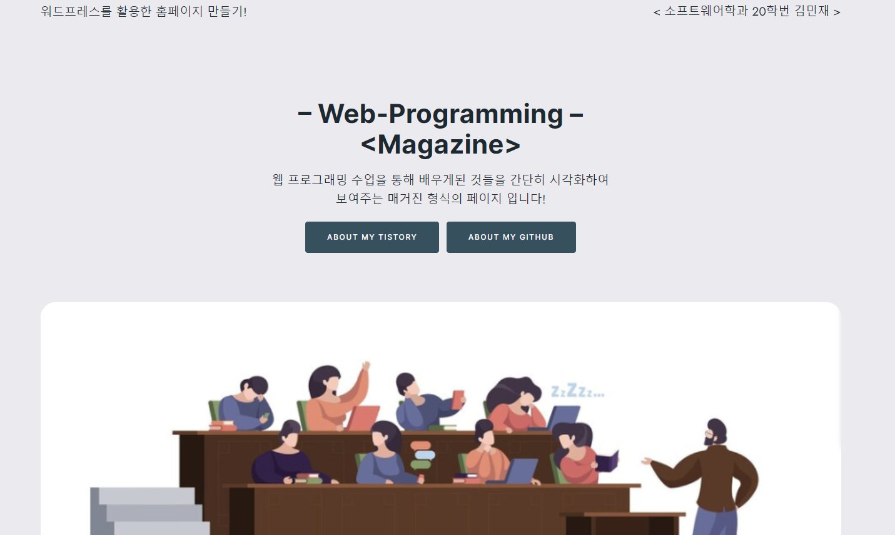
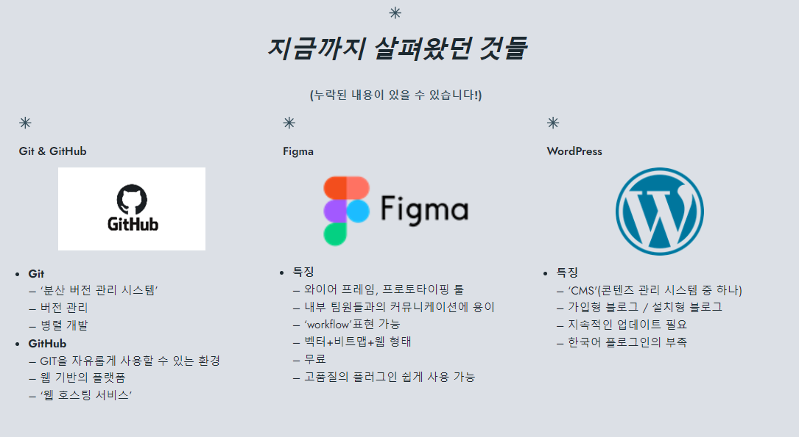
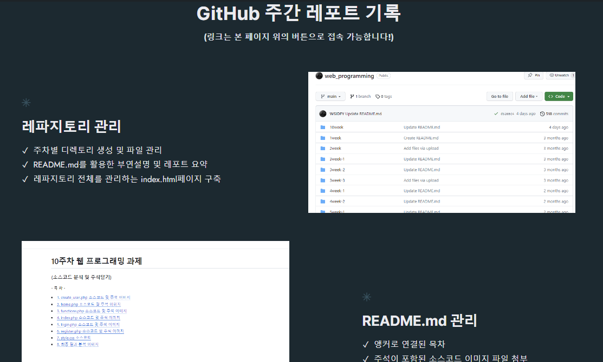

<!------------------제 목------------------------->

# WordPress를 활용한 홈페이지 만들기 웹 프로그래밍 과제

<!----------------------- 앵커로 연결된 목차 지정--------------------------->
### 홈페이지 링크(무료 호스팅 사이트'닷홈'이용) : http://webpro.dothome.co.kr/

#### - 목 차 -

<li><a href="#first">1. 닷홈 소개</a></li>
<li><a href="#second">2. 홈페이지 출력 이미지</a></li>
<li><a href="#third">3.홈페이지 설명</a></li>

  

<!------------------------------첫 번째 문제--------------------------------------->

### <strong id = "first"><b>1. 닷홈 소개</b></strong>
 

 </img> 

- 닷홈이란? 도메인, 무료 웹호스팅, 웹빌더, 메일호스팅, SSL보안인증서, 서버호스팅, 코로케이션 등등 다양한 호스팅 서비스를 제공하는 홈페이지이다.
- 일반적으로 웹사이트를 위한 서버는 언제든지 정보 제공이 가능하도록 24시간 운영해야 하기 때문에 인력, 자원, 비용 등이 많이 필요하게 된다.
  여기서 전문적인 관리가 이루어지는 호스팅 서비스를 이용하면 효율적이고 쉽게 서버를 이용할 수 있기에 '닷홈'과 같은 웹 호스팅 업체를 통하여 '워드프레스' 또는 'PHP'등으로 이뤄진
  웹 페이지를 호스팅 하고 배포하는 것이 가능해진다.

   </img> 
- 웹 호스팅을 하게 되면 위와 같은 호스팅 관리 페이지를 볼 수 있는데 이미지 처럼 '디스크의 사용량', '트래픽 사용량'등을 바로 확인할 수가 있어서 관리하기 용이하다.

<!-------------------------------두 번째 문제----------------------------------->

### <strong id = "second"><b>2. 홈페이지 출력 이미지</b></strong>
 

(2번 문제 소스코드 이미지)
 </img> 
 </img> 
 </img> 

<!-------------------------------세 번째 문제----------------------------------->

### <strong id = "third"><b>3. 홈페이지 설명</b></strong>
 

위의 이미지에서 볼 수 있는 홈페이지의 이미지는 'WordPress'를 활용하여 만든 웹 페이지를 '닷홈'에서 호스팅 한 모습이다.
현재까지 수업을 하며 어떤 것을 배워왔고 깃허브는 어떻게 관리되었는지 설명해주는 간단한 리뷰형 매거진 형식의 '정적 웹 페이지'라고 할 수 있다.
  
- 1번 이미지 
페이지 상단의 'ABOUT MY TISTORY' 버튼과 'ABOUT MY GITHUB'버튼을 누르면 각각 버튼에 할단된 주소로 이동하게 되어 새 페이지에서
지정된 링크의 웹 페이지로 이동하게 된다.

- 2번 이미지 
지금까지 수업 시간에 발표해왔던 주제들 중 일부를 발췌하여 이미지와 함께 리뷰하는 파트이다.

- 3번 이미지 
주간 레포트를 깃허브 내에서 어떤 방식으로 관리해왔는지 이미지와 함께 성명하는 파트이다.

